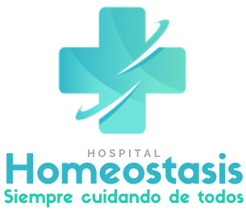

# 🏥 Hospital Homeostasis

**Ejercicio Práctico 1 - Módulo 2: Construcción de Interfaces Web**

Este proyecto consiste en el diseño e implementación de un sitio web informativo para el *Hospital Homeostasis*, aplicando HTML5, CSS3 y buenas prácticas de estructura semántica y accesibilidad.

---

## 📌 Estructura del sitio

El sitio cuenta con tres vistas principales:

- `index.html`: Página de inicio con mensaje de bienvenida, descripción de servicios, navegación y pie de página.
- `equipo.html`: Página del equipo médico con perfiles de doctores.
- `contacto.html`: Página de contacto con formulario y mapa.

---

## 🧠 Habilidades y contenidos aplicados

- HTML semántico
- Estructura modular con múltiples vistas
- CSS personalizado (modelo de cajas, tipografías, colores, botones)
- Organización del código (carpetas `css/`, `img/`)
- Uso de etiquetas accesibles y atributos `alt`
- Responsividad básica (media queries en proceso)

---

## 📷 Captura de pantalla

---

## 🚀 Cómo ver el proyecto

Puedes clonar este repositorio y abrir `index.html` en tu navegador, o ejecutarlo con **Live Server** desde Visual Studio Code.

---

## 📁 Créditos

Diseñado por **Lumina UX** como parte del Bootcamp de Desarrollo de Aplicaciones Front-End.  
[Ver repositorio del Bootcamp completo](https://github.com/iluminux/Bootcamp-FrontEnd)
