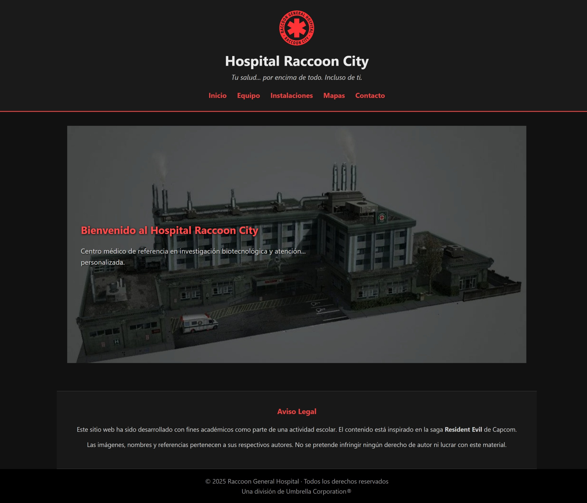
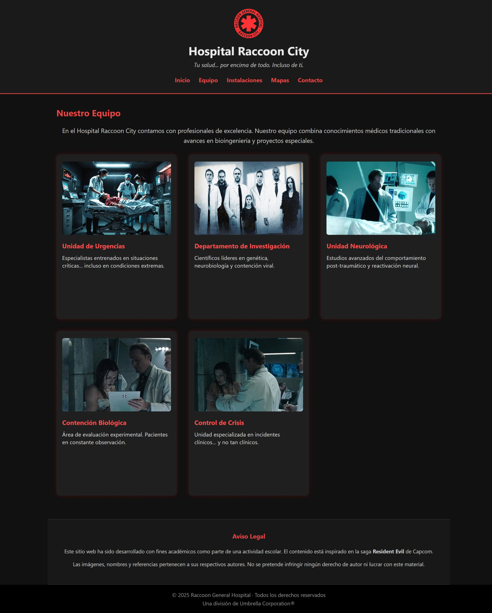
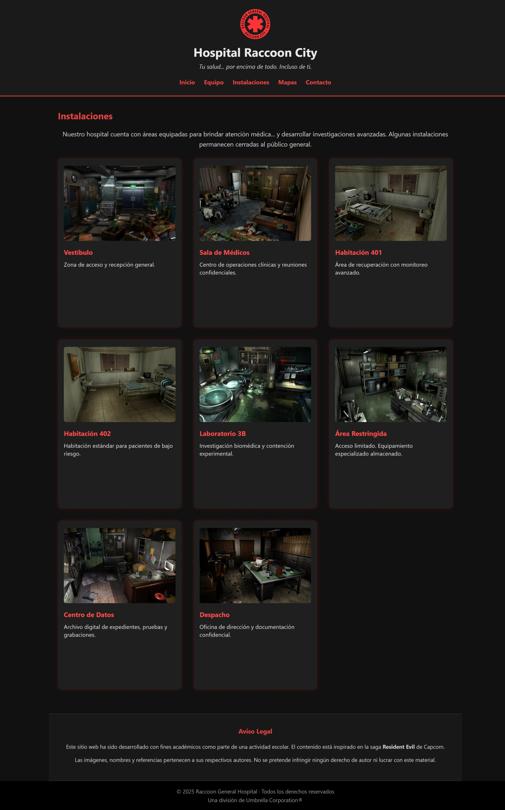
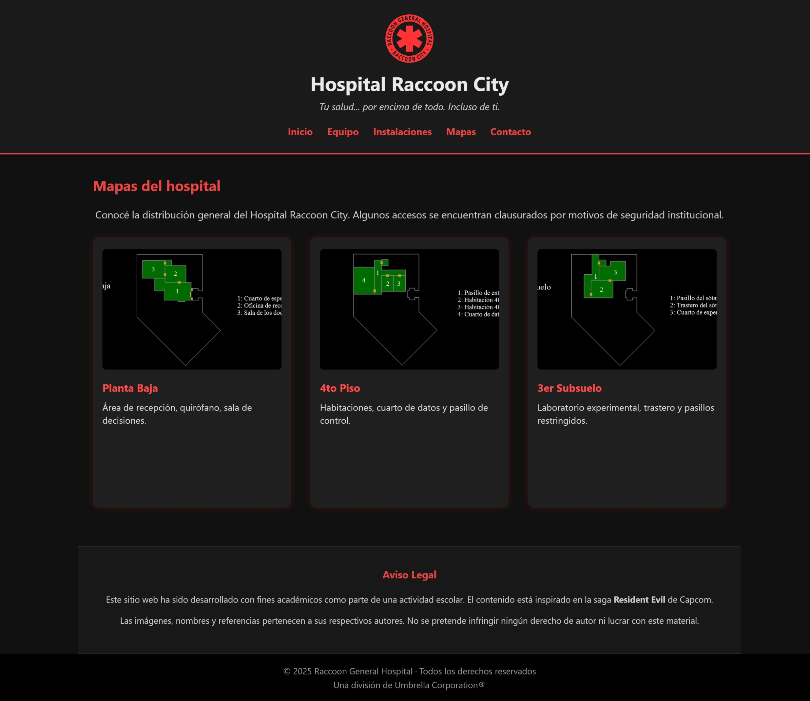
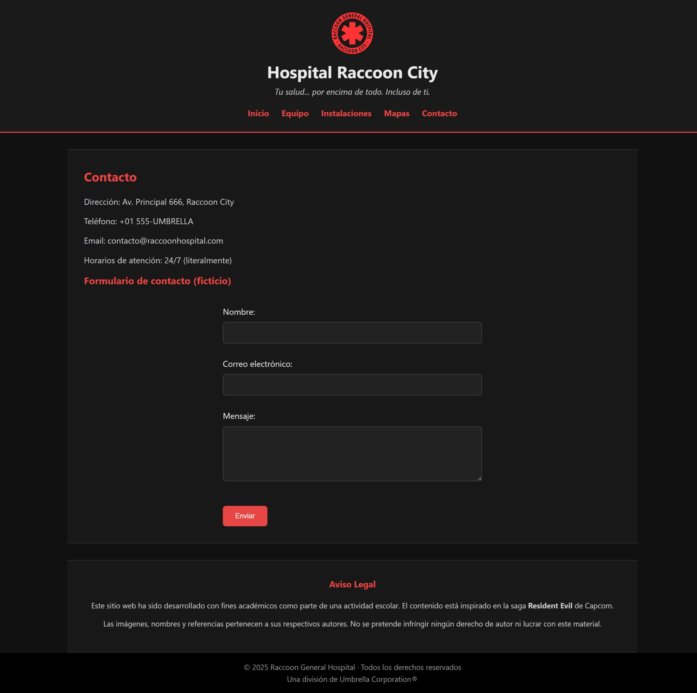

# Hospital Raccoon City

**Tu salud... por encima de todo. Incluso de ti.**

Este proyecto es una simulación web creada con fines educativos, ambientada en el universo de *Resident Evil*. Representa el sitio ficticio del "Hospital Raccoon City", inspirado en la estética y narrativa de la saga.

---

## 📅 Proyecto: Ejercicio 2 - Interfaz Web (HTML + SCSS)

> Reestructuración completa del HTML y CSS original utilizando buenas prácticas con SASS/SCSS.

---

## 🌐 Vistas del Sitio

### Inicio

### Equipo Médico

### Instalaciones

### Mapas

### Contacto

---

## 💡 Tecnologías Utilizadas

- HTML5 + SCSS
- Estructura modular con partials SCSS
- Flexbox y grid para maquetación
- Variables, mixins y nesting en SCSS
- Tipografía: Google Fonts
- Optimización de imágenes (.webp)

---

## 🔧 Estructura del Proyecto

02-interfaz-web/ ├── ejercicio-2/ ├── css/ │ └── styles.css ├── scss/ │ ├── abstracts/ │ ├── base/ │ ├── components/ │ ├── layout/ │ └── main.scss ├── img/ │ └── screenshots/ ├── index.html ├── equipo.html ├── contacto.html ├── instalaciones.html └── mapas.html

---

## 🎨 Temática y Estilo

- Paleta oscura (modo nocturno)
- Rojo Umbrella como acento
- Estilo clínico pero inquietante 🧐

---

## 🔍 Visualización Local

1. Clona o descarga el repositorio
2. Asegúrate de tener instalada la extensión **Live Sass Compiler** en VS Code
3. Activa el modo `Watch Sass`
4. Usa **Live Server** para visualizar `index.html`

---

## ⚠️ Aviso legal

Este sitio web ha sido desarrollado con fines académicos como parte de una actividad escolar. El contenido está inspirado en la saga **Resident Evil** de Capcom. Las imágenes, nombres y referencias pertenecen a sus respectivos autores.

## © 2025 Raccoon General Hospital
**Una división de Umbrella Corporation®**

---

🟢 Entregado como la 2da parte del Ejercicio práctico del  **Módulo 2 - Desarrollo de la Interfaz de Usuario Web** del Bootcamp Desarrollo de Aplicaciones Front-End.

---

## 👩‍💻 Autora
Desarrollado por Karina Hidalgo.

🚨 Advertencia: No se garantiza la recuperación total del paciente... ni su humanidad.
