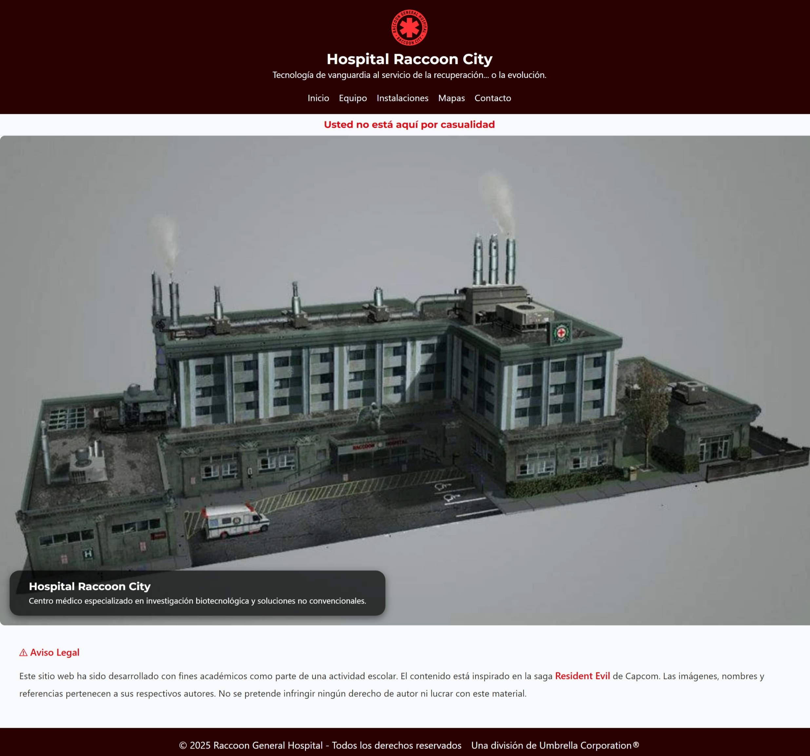

# Hospital Raccoon City

Este proyecto es una entrega para el **Ejercicio Práctico 3** del Módulo 2 del curso de Desarrollo Front-End. El objetivo fue maquetar una interfaz web utilizando HTML y SCSS organizados por arquitectura 7-1, e implementar variables, mixins y funciones de color personalizadas.

## 🏛️ Descripción
El sitio simula la página de un hospital ficticio basado en el universo de *Resident Evil*, con fines estrictamente académicos. Contiene estructura HTML semántica, hojas de estilo escritas en SCSS, y una organización de archivos según buenas prácticas.

## 🔧 Tecnologías utilizadas

- HTML5
- SCSS (SASS)
- Arquitectura 7-1 para SCSS
- VS Code + Live Server

## 🌐 Estructura de carpetas (resumen)

```
/ejercicio-3
|-- css/
|   |-- main.css
|
|-- scss/
|   |-- abstracts/
|   |   |-- _variables.scss
|   |   |-- _mixins.scss
|   |-- base/
|   |-- components/
|   |-- layout/
|   |-- main.scss
|
|-- img/
|   |-- logo/
|   |-- fachada/
|   |-- screenshots/screenshot-inicio.jpg
|
|-- index.html
|-- contacto.html
|-- instalaciones.html
|-- equipo.html
|-- mapa.html
```

## 📅 Estado del proyecto

El foco del ejercicio fue dejar funcional y con estilos aplicados **la página de inicio (`index.html`)**. Las demás páginas están presentes pero sin desarrollo estilístico completo, ya que **no es requisito según la rúbrica**.

## 📸 Vista previa

A continuación se muestra una captura de pantalla de la página de inicio con los estilos aplicados desde SCSS:



## ⚠️ Aviso legal

Este sitio web ha sido desarrollado con fines académicos como parte de una actividad escolar. El contenido está inspirado en la saga **Resident Evil** de Capcom. Las imágenes, nombres y referencias pertenecen a sus respectivos autores.

---
🟢 Entregado como la 3ra parte del Ejercicio práctico del  **Módulo 2 - Desarrollo de la Interfaz de Usuario Web** del Bootcamp Desarrollo de Aplicaciones Front-End.

---

## 👩‍💻 Autora
Desarrollado por Karina Hidalgo.

🚨 Advertencia: No se garantiza la recuperación total del paciente... ni su humanidad.