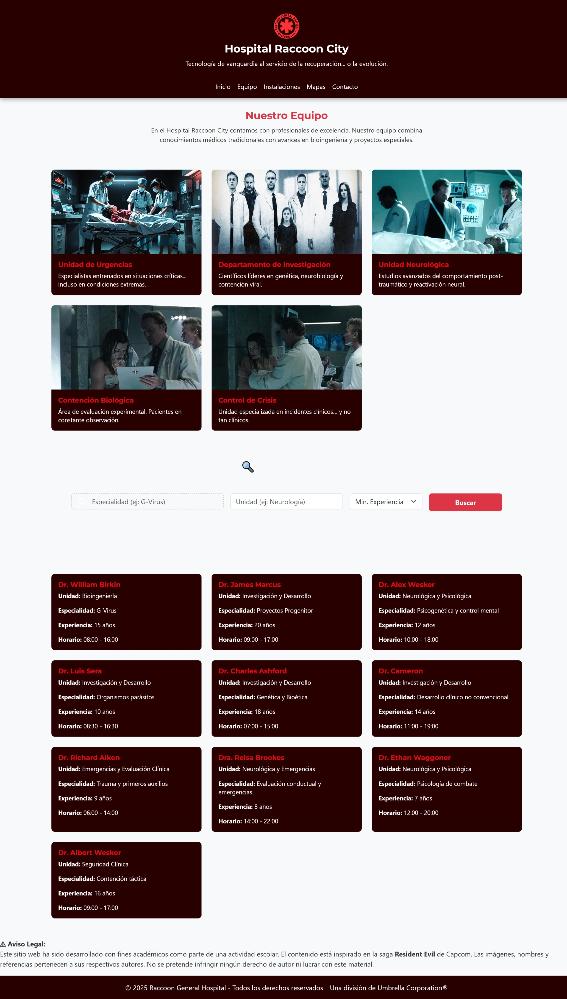
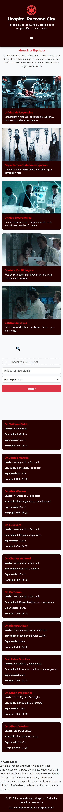

# 🏥 Hospital Raccoon City - Misión M3 L1 (Equipo Médico)

Este proyecto forma parte del Módulo 3 del Bootcamp de Desarrollo Front-End. Representa el desarrollo de la sección **Equipo Médico**, donde se combinan habilidades de maquetación, estilos avanzados con Sass, y funcionalidades con JavaScript para búsquedas dinámicas.

Inspirado en la saga *Resident Evil*, esta misión se enfoca en practicar el diseño responsivo, modularización de SCSS y manipulación del DOM con JavaScript.

---

## 👨‍🔬 Tecnologías utilizadas

- HTML5 + SCSS (estructura modular)
- JavaScript (DOM, funciones, eventos, arrays)
- Bootstrap 5 (grilla responsive + estilos)
- Live Sass Compiler

---

## ⚙️ Funcionalidades implementadas

### ✔️ Buscador extendido
Formulario con filtros de especialidad, unidad y experiencia mínima. Los resultados se renderizan dinámicamente desde un arreglo de objetos médicos.

### ✔️ Render dinámico con `filter()` y `forEach()`
```js
const resultado = doctores.filter(doc => /* condiciones */);
resultado.forEach(doc => {
  // render dinámico
});
```

### ✔️ Responsive design
Uso de clases de Bootstrap (`col-md`, `col-lg`) para adaptar tarjetas al tamaño de pantalla.

---

## 📸 Capturas de pantalla

### 💻 Vista escritorio


### 📱 Vista móvil


---

## ⚠️ Aviso legal

Este proyecto ha sido desarrollado con fines académicos. El contenido está inspirado en la franquicia *Resident Evil* de Capcom. No se persigue ningún fin comercial.

---

🎯 *Misión M3 L1 completada con éxito... y supervisión de Umbrella Corporation®*

---

🟢 Entregado como el 1er laboratorio del Módulo 3: Programación avanzada en JavaScript del Bootcamp Desarrollo de Aplicaciones Front-End.

---

## 👩‍💻 Autoría
Desarrollado por: **Karina Hidalgo**  