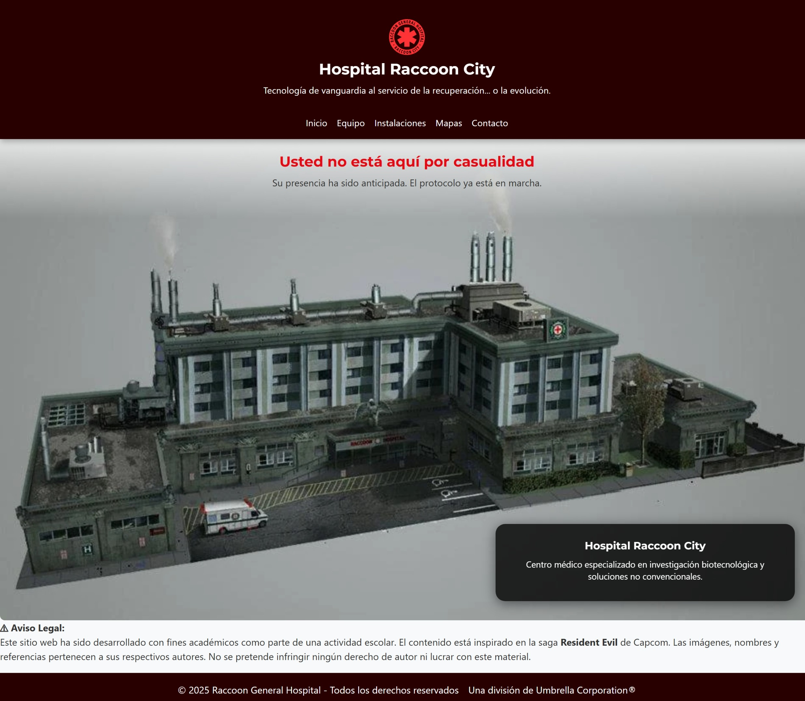
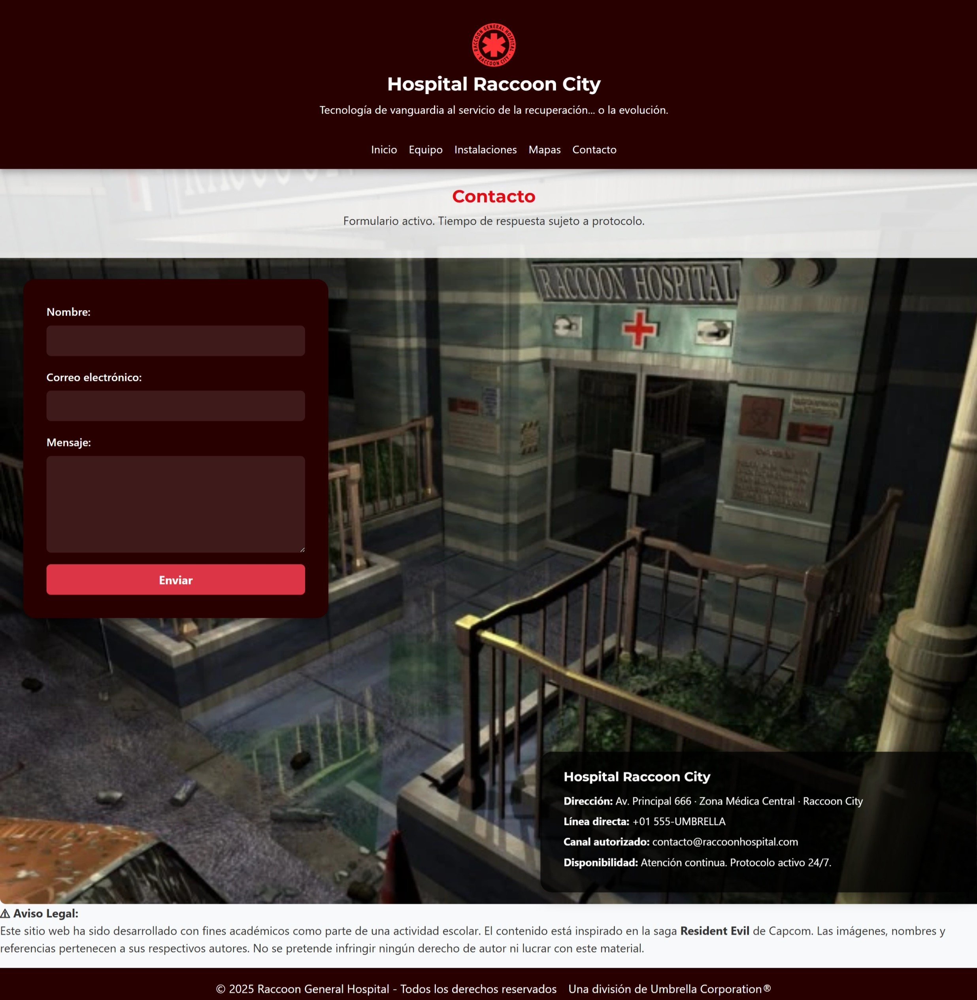

# 🏥 Hospital Raccoon City — Sitio Web

Proyecto desarrollado para el **Módulo 2: Programación Web Frontend**  
**Institución educativa:** Becas Capital Humano CORFO & CHILETEC | OTEC Adalid Ltda.  
**Estudiante:** Karina Hidalgo  
**Fecha:** Abril 2025

---

## 📌 Descripción

Sitio web ficticio del **Hospital Raccoon City**, inspirado en la saga *Resident Evil*.  
Diseñado con fines académicos para demostrar habilidades en desarrollo web frontend:  
maquetación semántica, diseño responsive, SCSS modular y uso de componentes Bootstrap.

El sitio incluye navegación completa entre las secciones: inicio, equipo médico, instalaciones, mapas y contacto.  
Todas las páginas cuentan con diseño adaptado, tipografías personalizadas y estilos consistentes.

---

## 🛠️ Tecnologías y Herramientas

- **HTML5**
- **SCSS / SASS** (estructura 7–1)
- **Bootstrap 5.3.3** (integrado vía CDN)
- **JavaScript básico** (interacción mínima)
- **Imágenes .webp optimizadas**
- **Diseño responsive** (con media queries y CSS Grid)

---

## 📁 Estructura del Proyecto

/EVALUACION-MODULO-2
│
├── css/
│   ├── main.css
│   └── main.css.map
│
├── img/
│   ├── logo/
│   ├── fachada/
│   ├── equipo/
│   ├── instalaciones/
│   ├── mapas/
│   ├── iconos/
│   └── screenshots/
│
├── scss/
│   ├── abstracts/
│   │   ├── _mixins.scss
│   │   └── _variables.scss
│   │
│   ├── base/
│   │   ├── _reset.scss
│   │   └── _typography.scss
│   │
│   ├── components/
│   │   ├── _buttons.scss
│   │   ├── _footer.scss
│   │   ├── _formulario.scss
│   │   ├── _header.scss
│   │   ├── _intro.scss
│   │   ├── _sections.scss
│   │   └── _tarjetas.scss
│   │
│   ├── layout/
│   │   ├── _contacto.scss
│   │   ├── _equipo.scss
│   │   ├── _home.scss
│   │   ├── _instalaciones.scss
│   │   └── _mapas.scss
│   │
│   ├── utilities/
│   │   └── _utilities.scss
│   │
│   ├── vendors/
│   │   └── _bootstrap.scss
│   │
│   └── main.scss
│
├── index.html
├── contacto.html
├── equipo.html
├── instalaciones.html
├── mapa.html
├── script.js
├── package.json
├── package-lock.json
└── README.md

---

## 📄 Estructura del Sitio

| Página              | Descripción                                                                            |
|---------------------|----------------------------------------------------------------------------------------|
| `index.html`         | Página principal con imagen hero, texto flotante, e introducción institucional.       |
| `equipo.html`        | Muestra al equipo médico con tarjetas visuales estilizadas.                          |
| `instalaciones.html` | Galería de las distintas instalaciones con imágenes e información detallada.         |
| `mapa.html`          | Planos del hospital representados como tarjetas interactivas.                        |
| `contacto.html`      | Formulario de contacto flotante con estilo personalizado y datos de la institución.  |

---

## 🧩 Funcionalidades Implementadas

- ✅ Navegación entre páginas
- ✅ SCSS modular y ordenado (7–1)
- ✅ Bootstrap 5 integrado y personalizado
- ✅ Diseño completamente responsivo
- ✅ Hero banners y overlays visuales
- ✅ Tarjetas visuales con efectos hover
- ✅ Formulario accesible y estilizado
- ✅ Aviso legal en todas las páginas

---

## 📸 Capturas de Pantalla

| Inicio | Equipo |
|:--:|:--:|
|  |  |

| Instalaciones | Mapas |
|:--:|:--:|
|  |  |

| Contacto |
|:--:|
|  |

---

## ⚠️ Observaciones

Este sitio fue creado exclusivamente con fines **académicos**.  
Todo el contenido visual está inspirado en la saga **Resident Evil** de **Capcom®**.  
No posee intención comercial ni de lucro.

---

## ✨ Autoría

Desarrollado por: **Karina Hidalgo**  
Bootcamp Desarrollo de Aplicaciones Front-End 
Evaluación · **Módulo 2**
