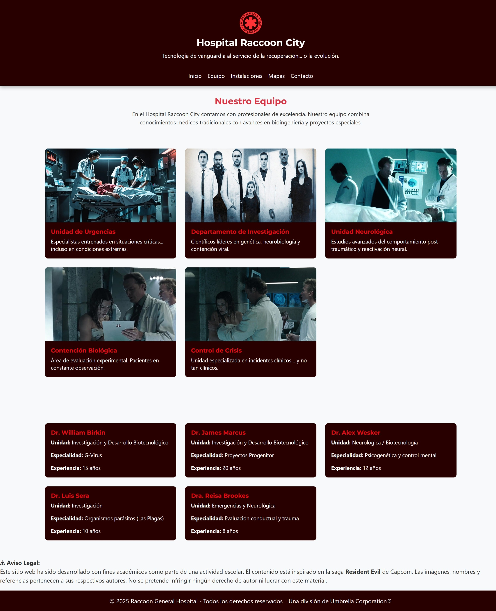
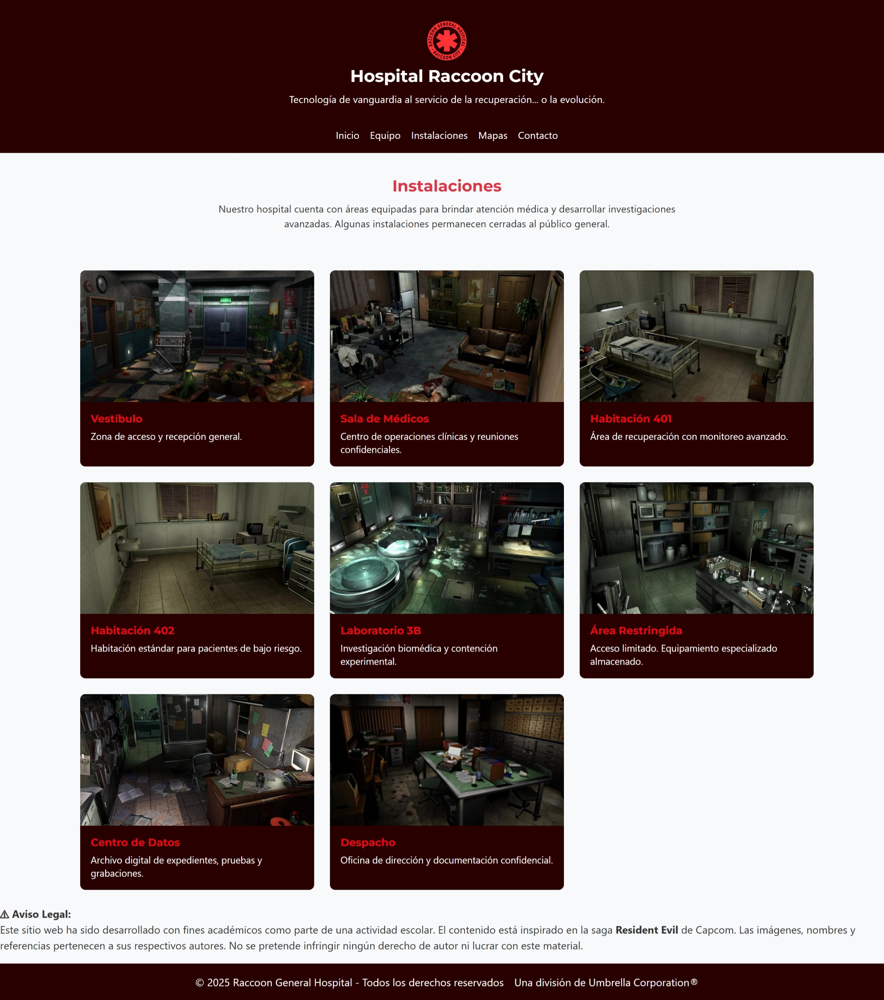
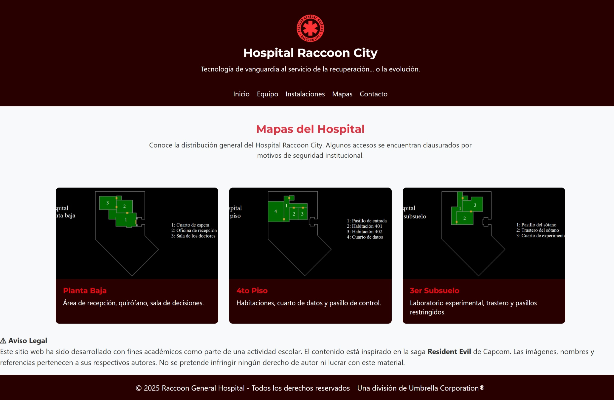
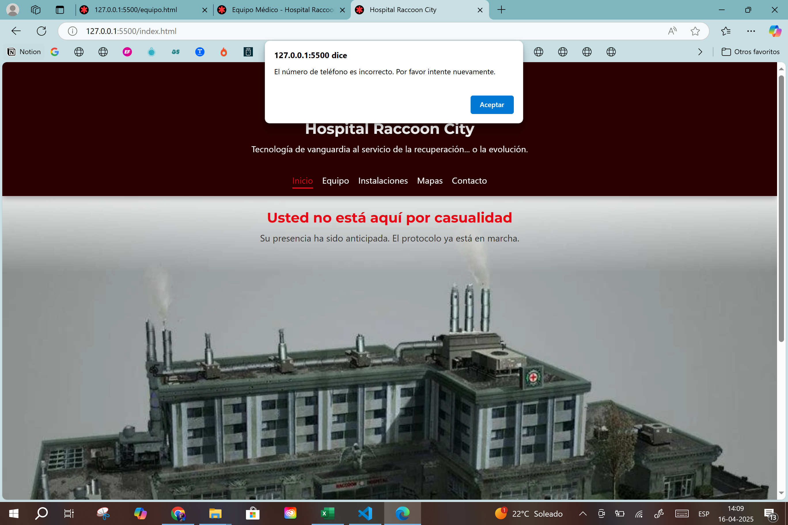
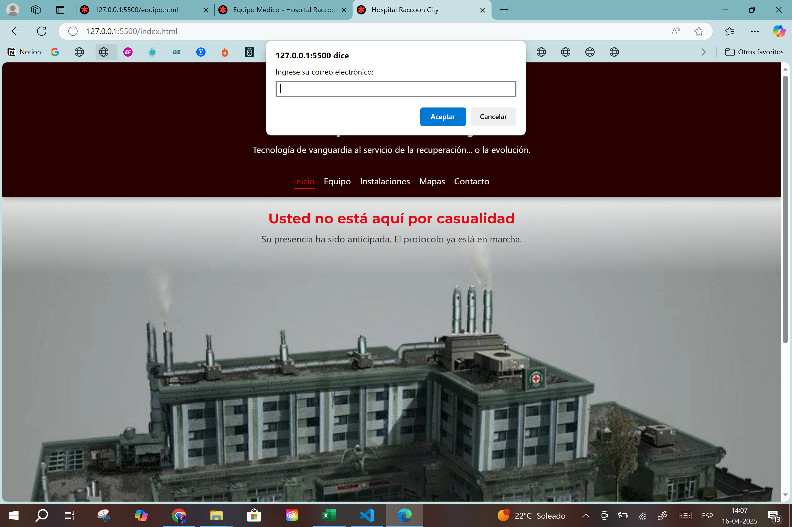
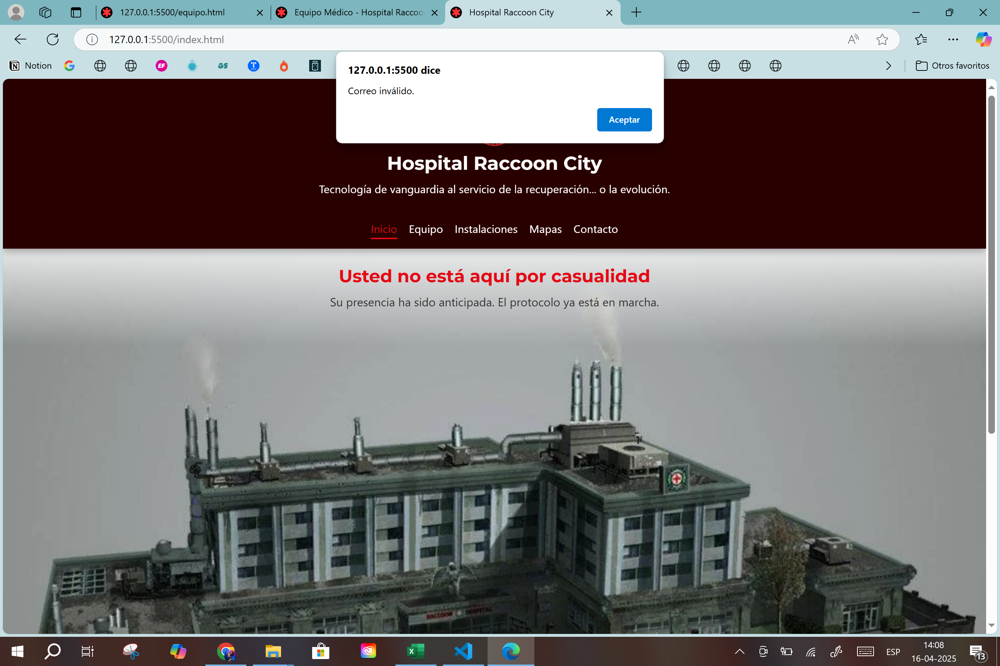

# 🏥 Hospital Raccoon City - Taller 2 (Módulo 3)

Este proyecto forma parte del Taller 2 del Módulo 3 del Bootcamp de Desarrollo Frontend. Se trata de una simulación académica de la página oficial del "Hospital Raccoon City", inspirada en la saga *Resident Evil* de Capcom.

## 👨‍💻 Tecnologías utilizadas

- HTML5 + SCSS (Sass modular)
- JavaScript (validación, DOM, condicionales, funciones, arreglos)
- Bootstrap 5 (para responsive grid)
- Live Sass Compiler

---

## 🎯 Funcionalidades JavaScript aplicadas

### ✔️ Menú hamburguesa
```js
toggle?.addEventListener('click', () => {
  nav?.classList.toggle('active');
});
```

### ✔️ Validación de datos con `prompt`, `alert` y `console`
```js
solicitarDatosUsuario();
```

### ✔️ Manejo de errores con `try/catch`
```js
function validarTelefono(telefono) {
  try {
    if (!telefono.match(/^\d{7,}$/)) {
      throw new Error("Número inválido");
    }
  } catch (error) {
    console.error(error.message);
  }
}
```

### ✔️ Arreglo de objetos + renderizado dinámico
```js
const doctores = [ /* ... */ ]
mostrarDoctores();
```

### ✔️ `debugger` habilitado para revisión en DevTools (comentado por defecto)

---

## 📚 Conceptos explicados

### 🔹 `let` vs `const`
- `let` permite reasignación (ideal para variables que cambian).
- `const` declara constantes (no se pueden reasignar).

### 🔹 Ámbito (Scope)
Las variables definidas con `let` y `const` tienen **scope de bloque**, es decir, solo viven dentro del bloque `{}` donde fueron declaradas.

### 🔹 `debugger`
Instrucción que **detiene la ejecución del JS** y permite analizar variables y flujo desde las herramientas del navegador.

### 🔹 Event Loop
El `event loop` en JS es el mecanismo que gestiona **la ejecución de funciones asincrónicas**, como `setTimeout`. En este proyecto, usamos `setTimeout()` para dar un pequeño retardo al cargar los datos.

---

## 📸 Capturas del proyecto

### 🧠 Inicio


### 🧪 Sección equipo


### 🏥 Instalaciones


### 🗺️ Mapa


### 📋 Validaciones
- Nombre vacío  

- Teléfono correcto  

- Teléfono incorrecto  

- Correo válido  

- Correo inválido  


---

## ⚠️ Aviso legal
Este proyecto fue desarrollado con fines académicos. El contenido está inspirado en la saga *Resident Evil* y no tiene fines comerciales.

---

🎉 *Proyecto completo y funcional – ¡entregado con estilo Umbrella Corporation®!*

---

🟢 Entregado como el 2do taller del Módulo 3: Programación avanzada en JavaScript del Bootcamp Desarrollo de Aplicaciones Front-End.

---

## 👩‍💻 Autoría
Desarrollado por: **Karina Hidalgo**  