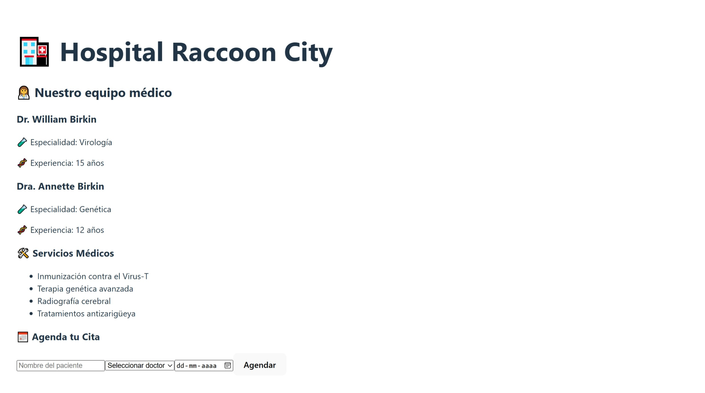

# 🏥 Hospital Raccoon City - Módulo 4 Ejercicio Práctico 1

Este proyecto forma parte del **Ejercicio Práctico 1** del Módulo 4 del Bootcamp de Desarrollo Frontend. Se trata de una **mini SPA (Single Page Application)** construida con **ReactJS y Vite** que simula el sistema básico de citas médicas del Hospital Raccoon City.

---

## 🎯 Objetivo

Implementar componentes reutilizables en React que permitan:

- Mostrar información del equipo médico.
- Listar los servicios médicos disponibles.
- Permitir a los usuarios agendar una cita mediante un formulario.

---

## ⚙️ Tecnologías

- ReactJS
- Vite
- JSX
- useState / useEffect
- props
- CSS básico (estilizado libre)

---

## 📷 Captura



---

## 📁 Estructura principal

hospital-raccoon/ ├── src/ │ ├── components/ │ │ ├── DoctorCard.jsx │ │ ├── ServiceList.jsx │ │ └── AppointmentForm.jsx │ ├── App.jsx │ └── main.jsx ├── public/ ├── index.html ├── vite.config.js └── README.md

---

## 🚀 ¿Cómo correr el proyecto?

1. Clona el repositorio o descargá el ZIP.
2. En la terminal, ubicáte en la carpeta `hospital-raccoon`.
3. Ejecutá:

```bash
npm install
npm run dev

Abre tu navegador en http://localhost:5173

✅ Requisitos cumplidos
 Componentes reutilizables (DoctorCard, ServiceList, AppointmentForm)

 Uso de JSX

 Props para comunicación entre componentes

 Listas dinámicas con keys

 Formulario con useState

 useEffect para simular carga de datos

📚 Autoría
Desarrollado por Karina Hidalgo como parte del Bootcamp Frontend – Módulo 4.

