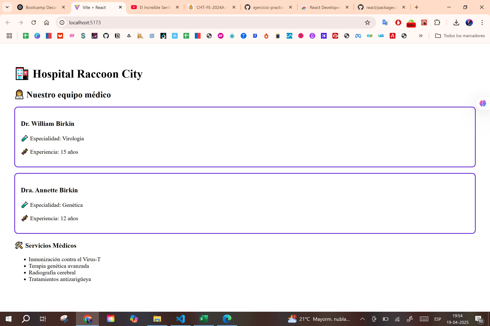
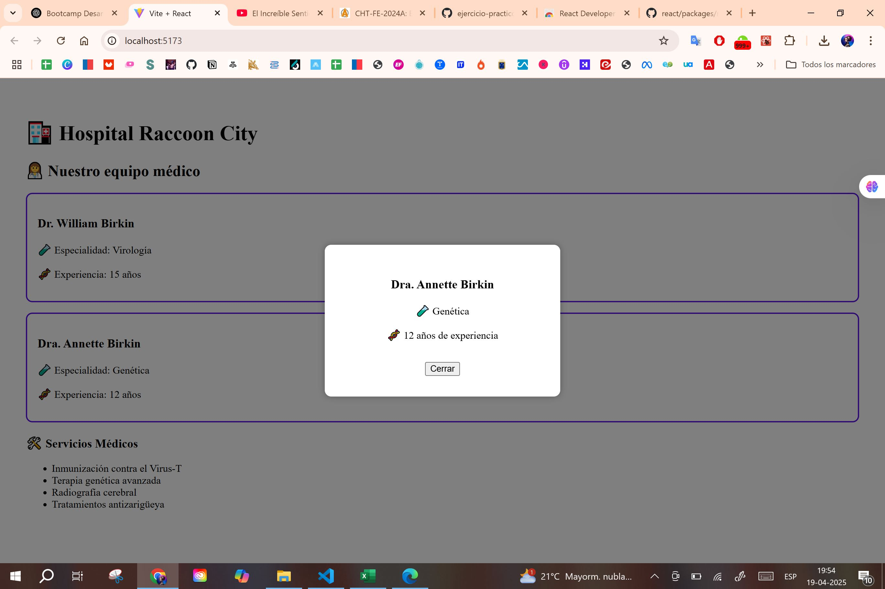

# 🧪 Hospital Raccoon City - Módulo 4 Ejercicio Práctico 2

Este proyecto es parte del **Ejercicio Práctico 2 del Módulo 4** del Bootcamp de Desarrollo Frontend. Se trata de una aplicación en React que aplica conceptos avanzados como:

- Virtual DOM
- Referencias (`ref`)
- Fragmentos y Contexto
- Validación con PropTypes
- Componentes de Orden Superior (HOC)
- Portales (modal)
- Análisis con React Profiler

---

## 🚑 Objetivo

Implementar buenas prácticas avanzadas en React en un contexto realista: el sistema web del **Hospital Raccoon City**.

---

## ⚙️ Tecnologías

- ReactJS + Vite
- JSX
- React Hooks (`useState`, `useEffect`, `useRef`)
- Context API
- PropTypes
- ReactDOM.createPortal
- React Developer Tools

---

## 🧠 Estructura del Proyecto

hospital-raccoon/ 
├── public/ 
│ └── index.html ⬅️ incluye <div id="modal-root" /> 
├── src/ 
│ ├── components/ 
│ │ ├── AppointmentForm.jsx 
│ │ ├── DoctorCard.jsx 
│ │ ├── DoctorModal.jsx ⬅️ modal vía portal 
│ │ ├── ServiceList.jsx 
│ │ └── withHospitalStyle.jsx ⬅️ HOC personalizado 
│ ├── context/ 
│ │ └── DoctorContext.jsx 
│ ├── App.jsx 
│ └── main.jsx 
└── README.md

---

## 🛠 ¿Cómo correr el proyecto?

1. Clona o descarga este repositorio.
2. En la terminal, ubicate en la carpeta `hospital-raccoon`.
3. Ejecuta:

```bash
npm install
npm run dev
Abrí http://localhost:5173 en tu navegador.

✅ Requisitos cumplidos
 DOM Virtual aplicado en carga de datos con useEffect.

 useRef para enfocar automáticamente el campo del formulario.

 Fragmentos (<>) en DoctorCard para evitar div innecesarios.

 Context API usado para compartir la lista de doctores.

 PropTypes definidos en todos los componentes.

 HOC personalizado (withHospitalStyle) aplicado a DoctorCard.

 Portal (createPortal) para modal con información del doctor.

 React Profiler utilizado para análisis de rendimiento.

📷 Capturas del proyecto

Vista general del sitio:  


Modal funcionando al seleccionar un doctor:  



👩‍💻 Autoría
Desarrollado por Karina Hidalgo como parte del Bootcamp Frontend – Módulo 4.