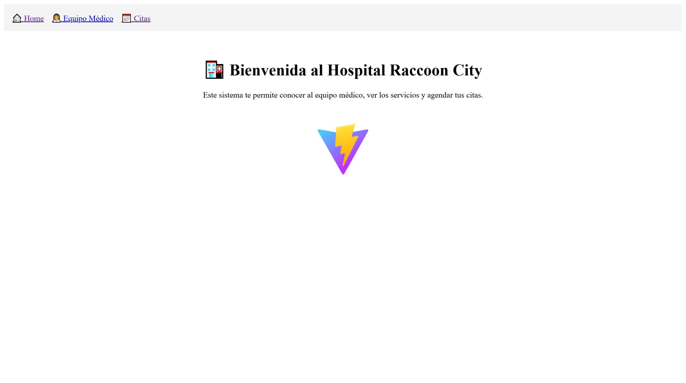
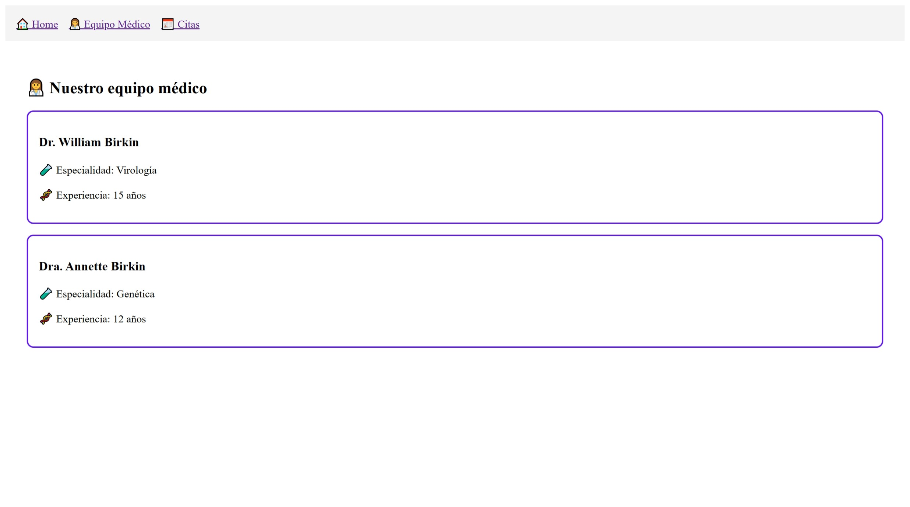
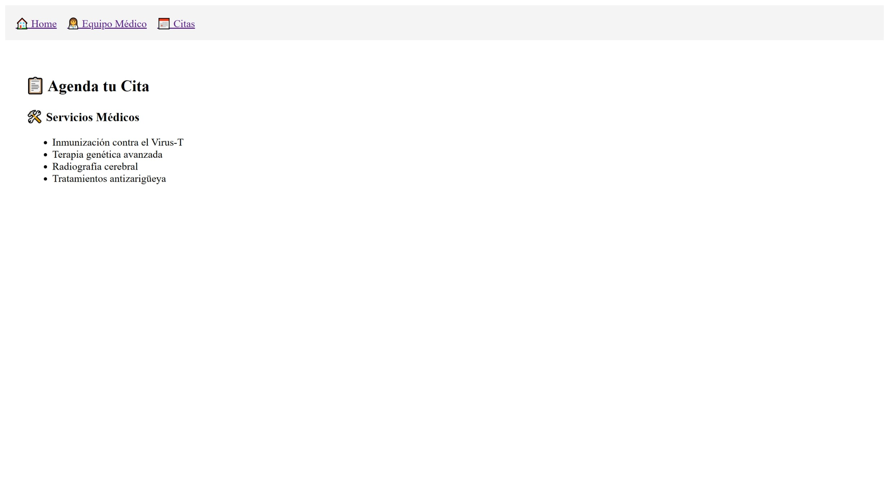

# 🏥 Hospital Raccoon City - Módulo 4 Ejercicio Práctico 3

Este proyecto es parte del **Ejercicio Práctico 3 del Módulo 4** del Bootcamp de Desarrollo Frontend. Se trata de una **SPA construida con React**, utilizando buenas prácticas de desarrollo, optimización y arquitectura de componentes.

---

## 🚀 Tecnologías utilizadas

- React + Vite
- React Router DOM
- React Context API
- React Portals
- PropTypes
- Hooks: `useState`, `useEffect`, `useRef`, `useContext`
- React Profiler
- Simulación de API (`fakeApi.js`)

---

## 🧠 Estructura del Proyecto

src/ 
├── api/ 
│ └── fakeApi.js 
├── components/ 
│ ├── AppointmentForm.jsx 
│ ├── DoctorCard.jsx 
│ ├── DoctorModal.jsx 
│ ├── ServiceList.jsx 
│ └── withHospitalStyle.jsx 
├── context/ 
│ └── DoctorContext.jsx 
├── views/ 
│ ├── Home.jsx 
│ ├── EquipoMedico.jsx 
│ └── Citas.jsx 
├── App.jsx 
└── main.jsx

img/screenshots/ ├
── screenshot-home.jpeg 
├── screenshot-equipo.jpeg └
── screenshot-citas.jpeg


---

## 🧩 Funcionalidades principales

- SPA con navegación entre secciones
- Carga de datos desde una “API” simulada
- Modal dinámico para mostrar detalle de doctores
- Formulario para agendar citas
- Validación de props con `PropTypes`
- Aplicación de `HOC` para reutilizar estilos
- Análisis con React Profiler
- Manejo de contexto global para los doctores

---

## ✅ Requisitos cumplidos

- [x] SPA con `react-router-dom`
- [x] Fragmentos y DOM Virtual (`<>`, `.map`)
- [x] `useRef` para enfocar formulario
- [x] Datos cargados desde `fakeApi.js` (fetch simulado)
- [x] Validación de Props con `PropTypes`
- [x] Modal con `ReactDOM.createPortal`
- [x] Análisis de rendimiento con React Profiler

---

## 📷 Capturas del Proyecto

**🏠 Home**  


**🧑‍⚕️ Equipo Médico con Modal**  


**📅 Agenda de Citas**  


---

## 🛠 ¿Cómo correr el proyecto?

1. Clona este repositorio o descarga el ZIP.
2. Ubicate en la carpeta `hospital-raccoon`.
3. Ejecutá los siguientes comandos:

```bash
npm install
npm run dev

👩‍💻 Autoría
Desarrollado por Karina Hidalgo como parte del Bootcamp Frontend – Módulo 4, ejercicio 3