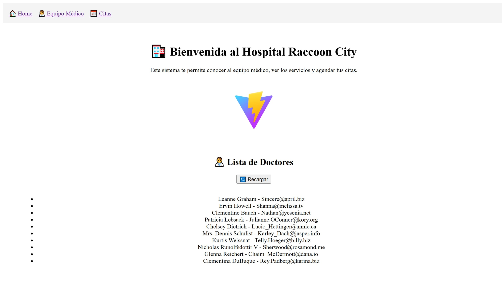

# 🧪 ABPro 1 - Módulo 5: Consumo de API

Este proyecto fue desarrollado como parte del **Ejercicio Práctico 1 del Módulo 5** del Bootcamp Front-End. Se trata de una aplicación React que consume una API externa simulando el sistema del Hospital Raccoon City.

---

## 🛠️ Tecnologías Utilizadas

- React
- Vite
- Hooks: `useState`, `useEffect`
- Axios (para llamadas HTTP)
- Simulación de API: [JSONPlaceholder](https://jsonplaceholder.typicode.com/users)

---

## ✅ Requisitos cumplidos

- [x] `useEffect` y `useState` para manejar la carga de datos.
- [x] Uso de **Axios** para llamadas HTTP.
- [x] Botón de recarga para volver a consultar la API.
- [x] Manejo de errores visible en la interfaz.
- [x] Optimización del `useEffect` para que solo se ejecute una vez.

---

## ✨ Justificación técnica

Se utilizó **Axios** porque proporciona una sintaxis más clara y manejable en comparación con `fetch`. Convierte automáticamente la respuesta en JSON, permite interceptores y mejora el control de errores, haciendo el código más limpio y escalable.

---

## 🚀 ¿Cómo ejecutar?

1. Clona el repositorio o descarga el ZIP.
2. En la terminal, ubícate en la carpeta `hospital-raccoon`.
3. Ejecuta los siguientes comandos:

```bash
npm install
npm run dev
Abre tu navegador en: http://localhost:5173

🖼️ Captura del proyecto
Vista de doctores obtenida desde la API:📷 Captura del funcionamiento  


👩‍💻 Autoría
Desarrollado por Karina Hidalgo como parte del Ejercicio 1 del Bootcamp Frontend – Módulo 5.