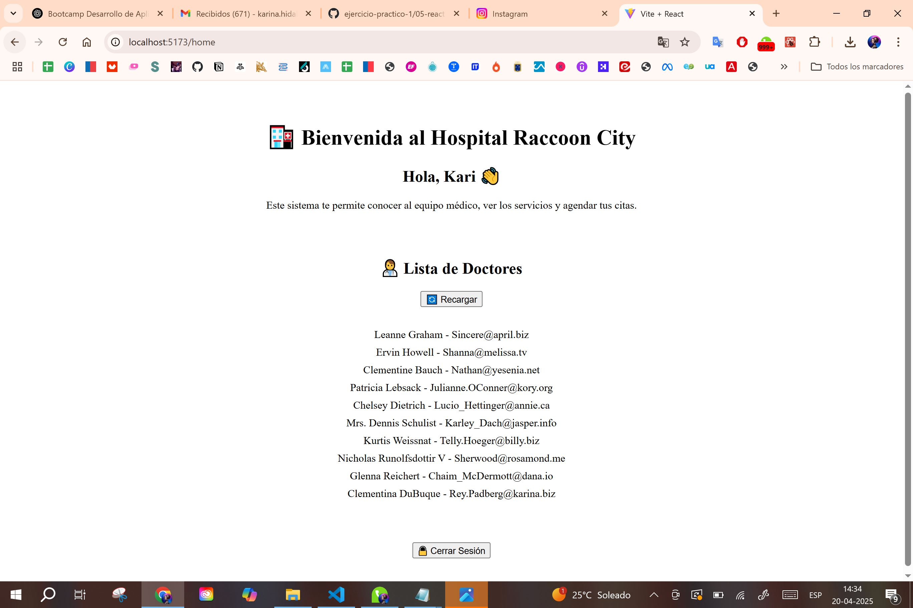
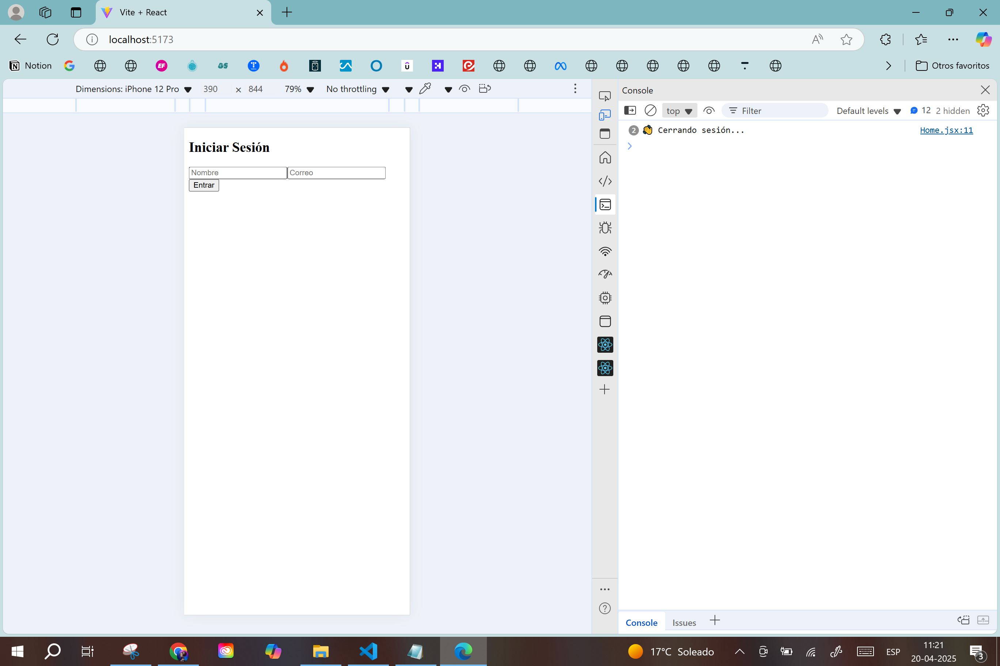

# 🧪 ABPro 2 - Módulo 5: Rutas protegidas y contexto de autenticación

Este proyecto es parte del segundo ejercicio del Módulo 5 del Bootcamp Front-End. Simula un sistema médico con login, rutas protegidas y contexto de autenticación usando React.

---

## 🛠️ Tecnologías Utilizadas

- React + Vite
- React Router DOM
- Context API
- Hooks: useState, useContext, useEffect
- JSONPlaceholder (API simulada)

---

## ✅ Requisitos cumplidos

- [x] Formulario de login simple (nombre y correo).
- [x] Contexto de autenticación (`AuthContext`) para guardar usuario.
- [x] Rutas protegidas (`RutaPrivada`) que redirigen si no estás logueado.
- [x] Página de bienvenida personalizada.
- [x] Botón de cerrar sesión.
- [x] Petición HTTP para obtener doctores desde una API.
- [x] Manejo de errores al cargar datos.
- [x] Botón para recargar datos.
- [x] Estilos mínimos y emojis para mejor experiencia.
- [x] Capturas del funcionamiento.

---

## ✨ Justificación técnica

- Se usa **Context API** para mantener el estado global del usuario.
- La **ruta protegida** asegura que solo usuarios logueados accedan a `/home` y otras páginas.
- `useEffect` permite hacer la llamada a la API al montar el componente.
- `useNavigate` facilita la redirección en React Router.
- La validación simple de inputs asegura una experiencia de login básica sin backend.

---

## 📁 Estructura del Proyecto

```
src/
├── components/
│   ├── Doctores.jsx
│   ├── ProtectedRoute.jsx
│   └── RutaPrivada.jsx
├── context/
│   └── AuthContext.jsx
├── views/
│   ├── Home.jsx
│   └── Login.jsx
├── App.jsx
├── main.jsx
└── App.css
```

---

## 🚀 ¿Cómo ejecutar?

1. Clona el repositorio o descarga el ZIP.
2. Abre la terminal y navega a la carpeta `hospital-raccoon`.
3. Ejecuta los siguientes comandos:

```bash
npm install
npm run dev
```

4. Abre tu navegador en: [http://localhost:5173](http://localhost:5173)

---

## 🖼️ Capturas del proyecto

### 🧑‍💻 Login


### 📬 Validación de campos
- Nombre obligatorio:  
    
- Correo obligatorio:  
  

### 🏠 Vista del Home (lista de doctores)


### 🔐 Logout


---

## 👩‍💻 Autoría

Desarrollado por **Karina Hidalgo** como parte del **Ejercicio 2** del Módulo 5 – Bootcamp Frontend.