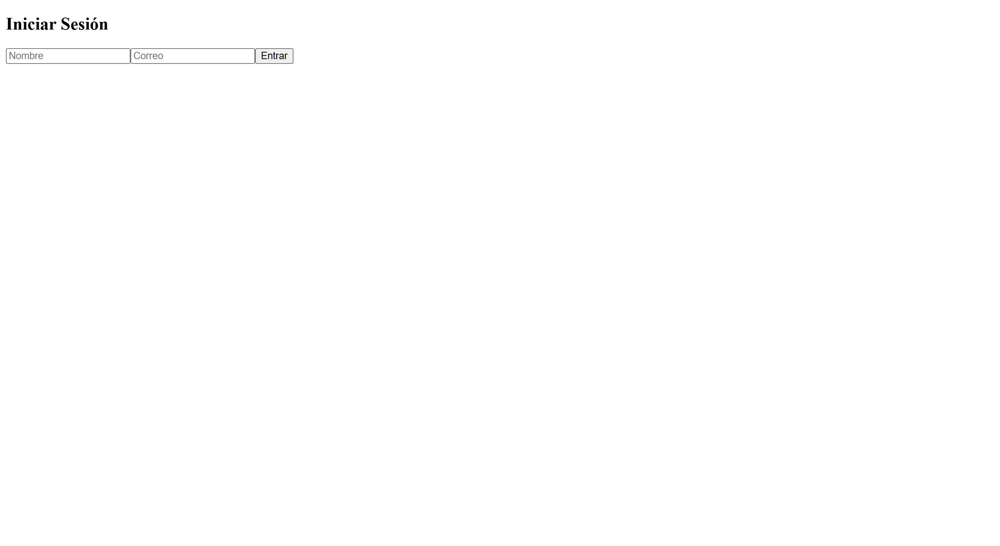
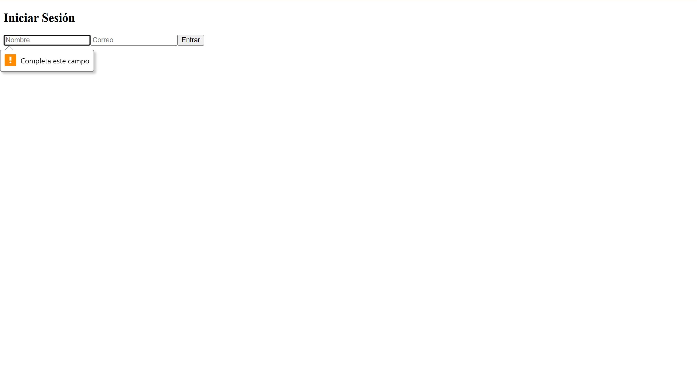
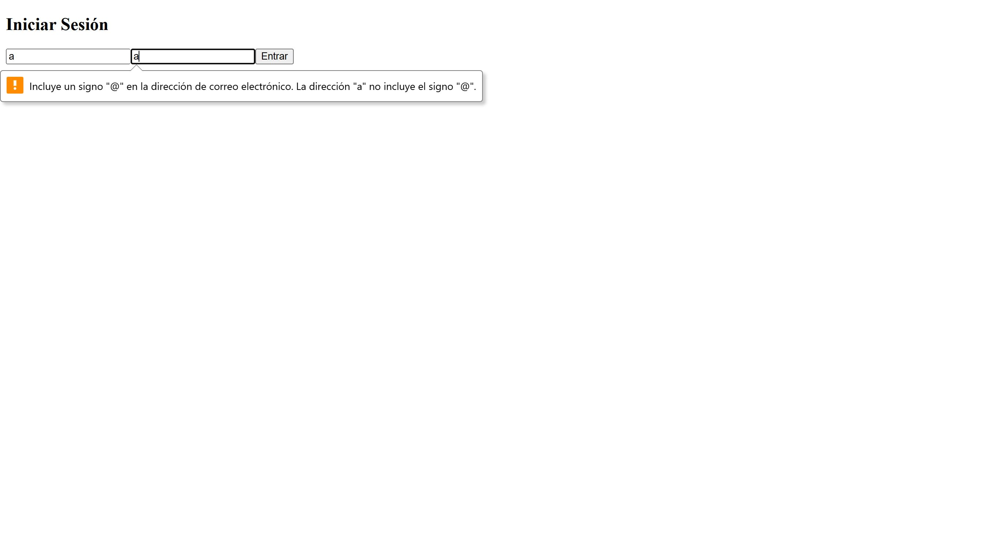
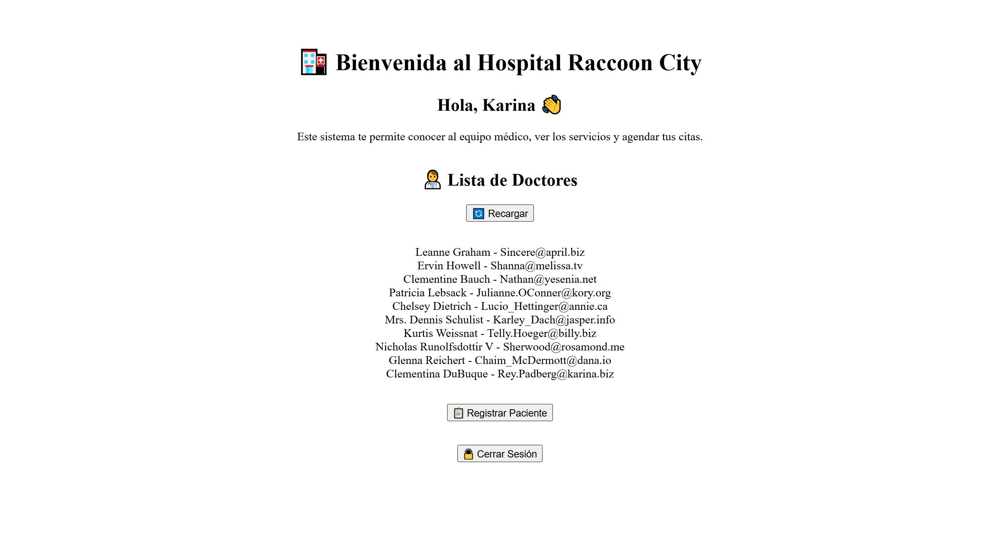
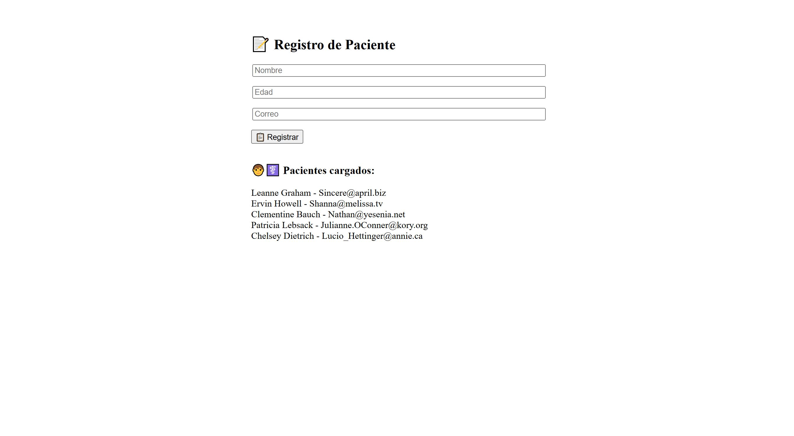
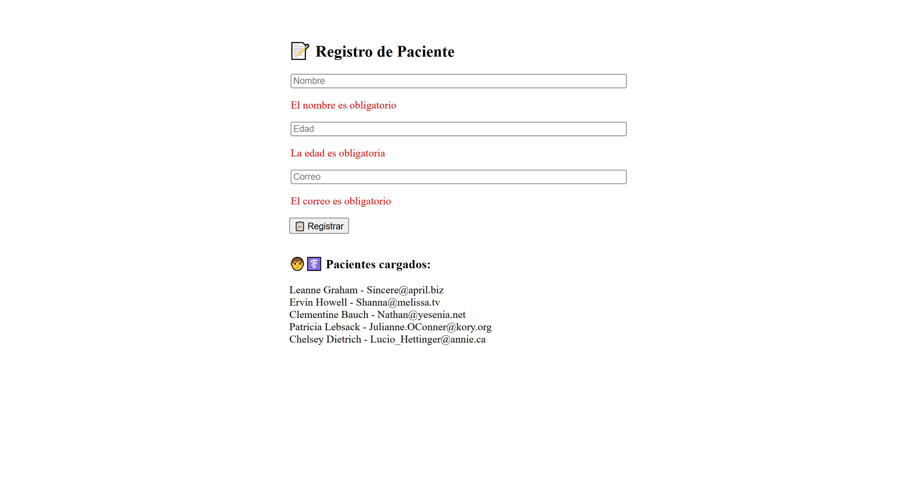
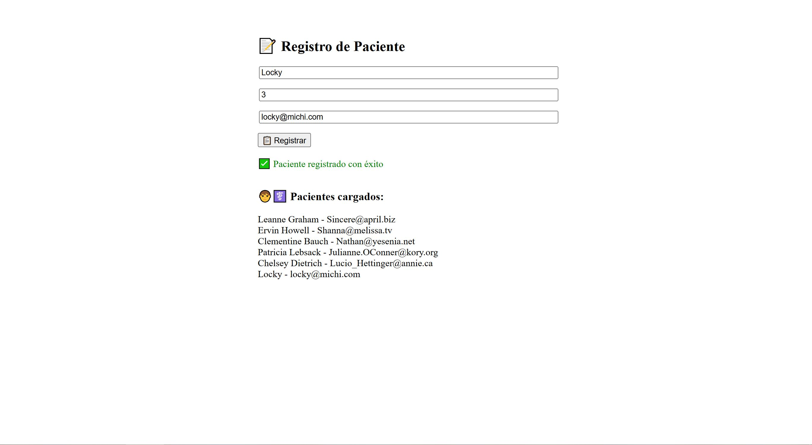

# 🏥 Hospital Raccoon City - Registro de Pacientes

Este proyecto consiste en una aplicación de gestión de pacientes que permite:
- Iniciar sesión con nombre y correo.
- Visualizar doctores desde una API simulada.
- Registrar pacientes con validaciones.
- Ver pacientes cargados.

---

## ⚙️ Tecnologías usadas

- React + Vite
- React Router DOM
- useContext + Hooks personalizados
- Fetch API + Axios
- Estilos inline y emojis para mejor UX

---

## 🧠 Habilidades aplicadas

✅ `useState` para manejar formularios  
✅ `useEffect` para cargar datos desde API  
✅ Hook personalizado `useFormularioPaciente`  
✅ Validaciones de campos obligatorios  
✅ Manejo de errores API y validaciones  
✅ Ruta protegida (`RutaPrivada.jsx`)  

---

## 📦 Estructura del proyecto

```
src/
├── components/
│   ├── Doctores.jsx
│   ├── RegistroPaciente.jsx
│   ├── RutaPrivada.jsx
├── context/
│   └── AuthContext.jsx
├── hooks/
│   └── useFormularioPaciente.js
├── views/
│   ├── Home.jsx
│   └── Login.jsx
├── App.jsx
├── main.jsx
```

---

## 📸 Capturas de pantalla

### 🟢 Inicio de sesión

- Campos obligatorios para ingresar:





---

### 🏠 Vista Home

- Bienvenida + listado de doctores:



---

### 📝 Registro de Pacientes

- Formulario + validación:

  
  


---

## 🚀 Cómo correr el proyecto

```bash
# Instala las dependencias
npm install

# Inicia el servidor de desarrollo
npm run dev
```

---

## 👩‍💻 Autoría

Desarrollado por Karina Hidalgo como parte del Ejercicio 3 del Módulo 5 del Bootcamp Desarrollo de aplicaciones Frontend.